# 張植鈞 <span style="color:red">(student ID: 102061214)</span>

# Project 3 / Scene recognition with bag of words

## Overview

The goal of this project is to inplement image recognition. Specifically, we will examine the task of scene recognition starting with very simple methods: tiny images and nearest neighbor classification, and then move on to the bags of quantized local features and linear classifiers learned by support vector machines.

## Implementation

1.Tiny Image Representation(get_tiny_images.m)

The "tiny image" feature is one of the simplest possible image representations. To build a tiny image feature, simply resize the original image to a very small square resolution, e.g. 16x16, and make the tiny images zero mean and unit length (normalizing them).

Algorithm:

```
for i = 1 to number of images  
    resize image to 16x16
    features = (image - mean)/norm
end
return features
```

See get_tiny_images.m for more details.

2.Nearest Neighbor Classifier(nearest_neighbor_classify.m)

When tasked with classifying a test feature into a particular category, one simply finds the "nearest" training example (L2 distance is a sufficient metric) and assigns the test case the label of that nearest training example. Instead of 1 nearest
neighbor, voting based on k nearest neighbors which will increase performance.

Algorithm:

```
k nearest neighbors
compute distances between train and test features
sort the distances from small to large
for i = 1 to number of test feature
    get top k nominees
    for j = 1 ti number of labels
        compute how many votes among all labels
    end
end
choose the highest votes
return the highest votes label
```

See nearest_neighbor_classify.m for more details.

3.Establish a Vocabulary of Visual Words(build_vocabulary.m)

Before representing training and testing images as bag of feature histograms, we first need to establish a vocabulary of visual words. We will form this vocabulary by sampling many local features from our training set and then clustering them with kmeans. The number of kmeans clusters is the size of our vocabulary and the size of our features. For any new SIFT feature we observe, we can figure out which region it belongs to as long as we save the centroids of our original clusters. Those centroids are our visual word vocabulary. 

Algorithm:

```
number of sampling features
for i = 1 to number of training image
    read image
    get SIFT feature from the image
    sample the SIFT feature
end
clustering SIFT descriptors into k clusters.
reture centers
```

 See build_vocabulary.m for more details.

4.Bag of SIFT Representation(get_bags_of_sifts.m)

We simply count how many SIFT descriptors fall into each cluster in our visual word vocabulary, assign each local feature to its nearest cluster center, and build a histogram indicating how many times each cluster was used.

Algorithm:

```
build a forest of kd-trees
for i = 1 to number of image
	read image
    get SIFT_features
    computes the nearest column of vocab to each column of features
    get the number of elements in each bin
    represent the image as bag of feature histograms
    normalization
end
return features
```

See get_bags_of_sifts.m for more details.

5.Train 1-vs-all Linear SVM(svm_classify.m)

Train a linear SVM for every category (i.e. one vs all) and then use the learned linear classifiers to predict the category of
every test image. Every test feature will be evaluated with all 15 SVMs and the most confident SVM will win.

Algorithm:

```
lambda(regularizes the linear classifier by encouraging W to be of small magnitude)
for i = 1 to number of categories
    initail to negative side of the decision boundary
    matching index set to 1
    train linear svms based on training examples
	score = W*(test image feature) + B
end
return the highest score label
```

See svm_classify.m for more details.

6.Add additional, Complementary Features e.g. gist descriptors(get_image_gists.m)

To get the GIST descriptor, first convolve the image with 32 Gabor filters at 4 scales, 8 orientations, which produces 32 feature maps of the same size of the input image. Then, divide each feature map into 16 regions (by a 4x4 grid), and then average the feature values within each region. Finally, concatenate the 16 averaged values of all 32 feature maps, resulting in a 16 x 32 = 512 GIST descriptor. Intuitively, GIST summarizes the gradient information (scales and orientations) for different parts of an image, which provides a rough description of the scene.

See get_image_gists.m for more details.

## Installation
* How to compile from source?

Run proj3.m in Matlab

## Result

* Do nothing, just run with random guessing: Accuracy = 6.5%

* Tiny Image + Nearest Neighbor Classifier: Accuracy = 22.1%

* Bag of SIFT Representation + Nearest Neigbor Classifier: Accuracy = 49.7%

* Bag of SIFT Representation + Linear SVM Classifier(lambda = 0.00001): Accuracy = 64.1%

* Gist Descriptor + Linear SVM Classifier(lambda = 0.00001): Accuracy = 67.8%

* Experiment with many different vocabulary sizes(Bag of SIFT Representation + Linear SVM Classifier):

10: Accuracy = 46.1%

20: Accuracy = 57.6%

50: Accuracy = 64.5%

100: Accuracy = 67.3%

200: Accuracy = 65.9%

400: Accuracy = 64.1%

1000: Accuracy = 61.7%
<center>
<h1>Project 3 results visualization</h1>


<br>
Accuracy (mean of diagonal of confusion matrix) is 0.679
<p>

<table border=0 cellpadding=4 cellspacing=1>
<tr>
<th>Category name</th>
<th>Accuracy</th>
<th colspan=2>Sample training images</th>
<th colspan=2>Sample true positives</th>
<th colspan=2>False positives with true label</th>
<th colspan=2>False negatives with wrong predicted label</th>
</tr>
<tr>
<td>Kitchen</td>
<td>0.510</td>
<td bgcolor=LightBlue></td>
<td bgcolor=LightBlue></td>
<td bgcolor=LightGreen></td>
<td bgcolor=LightGreen></td>
<td bgcolor=LightCoral><br><small>Store</small></td>
<td bgcolor=LightCoral><br><small>Store</small></td>
<td bgcolor=#FFBB55><br><small>Store</small></td>
<td bgcolor=#FFBB55>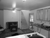<br><small>LivingRoom</small></td>
</tr>
<tr>
<td>Store</td>
<td>0.540</td>
<td bgcolor=LightBlue></td>
<td bgcolor=LightBlue></td>
<td bgcolor=LightGreen></td>
<td bgcolor=LightGreen>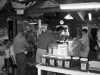</td>
<td bgcolor=LightCoral><br><small>InsideCity</small></td>
<td bgcolor=LightCoral><br><small>Bedroom</small></td>
<td bgcolor=#FFBB55><br><small>Forest</small></td>
<td bgcolor=#FFBB55><br><small>Kitchen</small></td>
</tr>
<tr>
<td>Bedroom</td>
<td>0.530</td>
<td bgcolor=LightBlue></td>
<td bgcolor=LightBlue></td>
<td bgcolor=LightGreen></td>
<td bgcolor=LightGreen></td>
<td bgcolor=LightCoral><br><small>LivingRoom</small></td>
<td bgcolor=LightCoral>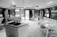<br><small>LivingRoom</small></td>
<td bgcolor=#FFBB55><br><small>LivingRoom</small></td>
<td bgcolor=#FFBB55><br><small>InsideCity</small></td>
</tr>
<tr>
<td>LivingRoom</td>
<td>0.490</td>
<td bgcolor=LightBlue></td>
<td bgcolor=LightBlue></td>
<td bgcolor=LightGreen></td>
<td bgcolor=LightGreen></td>
<td bgcolor=LightCoral><br><small>Bedroom</small></td>
<td bgcolor=LightCoral><br><small>Bedroom</small></td>
<td bgcolor=#FFBB55><br><small>Kitchen</small></td>
<td bgcolor=#FFBB55><br><small>TallBuilding</small></td>
</tr>
<tr>
<td>Office</td>
<td>0.800</td>
<td bgcolor=LightBlue></td>
<td bgcolor=LightBlue></td>
<td bgcolor=LightGreen></td>
<td bgcolor=LightGreen></td>
<td bgcolor=LightCoral><br><small>Industrial</small></td>
<td bgcolor=LightCoral><br><small>Store</small></td>
<td bgcolor=#FFBB55><br><small>LivingRoom</small></td>
<td bgcolor=#FFBB55><br><small>Bedroom</small></td>
</tr>
<tr>
<td>Industrial</td>
<td>0.380</td>
<td bgcolor=LightBlue></td>
<td bgcolor=LightBlue></td>
<td bgcolor=LightGreen></td>
<td bgcolor=LightGreen></td>
<td bgcolor=LightCoral><br><small>Bedroom</small></td>
<td bgcolor=LightCoral><br><small>InsideCity</small></td>
<td bgcolor=#FFBB55><br><small>Store</small></td>
<td bgcolor=#FFBB55><br><small>TallBuilding</small></td>
</tr>
<tr>
<td>Suburb</td>
<td>0.900</td>
<td bgcolor=LightBlue></td>
<td bgcolor=LightBlue></td>
<td bgcolor=LightGreen></td>
<td bgcolor=LightGreen></td>
<td bgcolor=LightCoral><br><small>Bedroom</small></td>
<td bgcolor=LightCoral>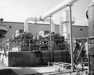<br><small>Industrial</small></td>
<td bgcolor=#FFBB55><br><small>Store</small></td>
<td bgcolor=#FFBB55><br><small>Industrial</small></td>
</tr>
<tr>
<td>InsideCity</td>
<td>0.680</td>
<td bgcolor=LightBlue></td>
<td bgcolor=LightBlue></td>
<td bgcolor=LightGreen></td>
<td bgcolor=LightGreen></td>
<td bgcolor=LightCoral><br><small>TallBuilding</small></td>
<td bgcolor=LightCoral><br><small>Industrial</small></td>
<td bgcolor=#FFBB55><br><small>Kitchen</small></td>
<td bgcolor=#FFBB55><br><small>Industrial</small></td>
</tr>
<tr>
<td>TallBuilding</td>
<td>0.670</td>
<td bgcolor=LightBlue></td>
<td bgcolor=LightBlue></td>
<td bgcolor=LightGreen></td>
<td bgcolor=LightGreen></td>
<td bgcolor=LightCoral><br><small>InsideCity</small></td>
<td bgcolor=LightCoral><br><small>Industrial</small></td>
<td bgcolor=#FFBB55><br><small>Industrial</small></td>
<td bgcolor=#FFBB55><br><small>InsideCity</small></td>
</tr>
<tr>
<td>Street</td>
<td>0.760</td>
<td bgcolor=LightBlue></td>
<td bgcolor=LightBlue></td>
<td bgcolor=LightGreen></td>
<td bgcolor=LightGreen></td>
<td bgcolor=LightCoral><br><small>Bedroom</small></td>
<td bgcolor=LightCoral><br><small>Highway</small></td>
<td bgcolor=#FFBB55><br><small>Store</small></td>
<td bgcolor=#FFBB55><br><small>LivingRoom</small></td>
</tr>
<tr>
<td>Highway</td>
<td>0.860</td>
<td bgcolor=LightBlue></td>
<td bgcolor=LightBlue></td>
<td bgcolor=LightGreen></td>
<td bgcolor=LightGreen></td>
<td bgcolor=LightCoral><br><small>Coast</small></td>
<td bgcolor=LightCoral><br><small>Kitchen</small></td>
<td bgcolor=#FFBB55><br><small>InsideCity</small></td>
<td bgcolor=#FFBB55><br><small>Bedroom</small></td>
</tr>
<tr>
<td>OpenCountry</td>
<td>0.690</td>
<td bgcolor=LightBlue></td>
<td bgcolor=LightBlue></td>
<td bgcolor=LightGreen>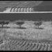</td>
<td bgcolor=LightGreen>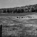</td>
<td bgcolor=LightCoral><br><small>LivingRoom</small></td>
<td bgcolor=LightCoral>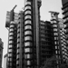<br><small>TallBuilding</small></td>
<td bgcolor=#FFBB55>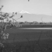<br><small>Coast</small></td>
<td bgcolor=#FFBB55><br><small>Coast</small></td>
</tr>
<tr>
<td>Coast</td>
<td>0.790</td>
<td bgcolor=LightBlue></td>
<td bgcolor=LightBlue></td>
<td bgcolor=LightGreen>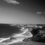</td>
<td bgcolor=LightGreen></td>
<td bgcolor=LightCoral><br><small>Highway</small></td>
<td bgcolor=LightCoral><br><small>Highway</small></td>
<td bgcolor=#FFBB55><br><small>Mountain</small></td>
<td bgcolor=#FFBB55><br><small>OpenCountry</small></td>
</tr>
<tr>
<td>Mountain</td>
<td>0.750</td>
<td bgcolor=LightBlue></td>
<td bgcolor=LightBlue></td>
<td bgcolor=LightGreen></td>
<td bgcolor=LightGreen></td>
<td bgcolor=LightCoral><br><small>Coast</small></td>
<td bgcolor=LightCoral>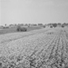<br><small>OpenCountry</small></td>
<td bgcolor=#FFBB55><br><small>Bedroom</small></td>
<td bgcolor=#FFBB55><br><small>Industrial</small></td>
</tr>
<tr>
<td>Forest</td>
<td>0.830</td>
<td bgcolor=LightBlue></td>
<td bgcolor=LightBlue></td>
<td bgcolor=LightGreen></td>
<td bgcolor=LightGreen></td>
<td bgcolor=LightCoral><br><small>OpenCountry</small></td>
<td bgcolor=LightCoral>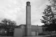<br><small>Industrial</small></td>
<td bgcolor=#FFBB55><br><small>Store</small></td>
<td bgcolor=#FFBB55><br><small>Store</small></td>
</tr>
<tr>
<th>Category name</th>
<th>Accuracy</th>
<th colspan=2>Sample training images</th>
<th colspan=2>Sample true positives</th>
<th colspan=2>False positives with true label</th>
<th colspan=2>False negatives with wrong predicted label</th>
</tr>
</table>
</center>


